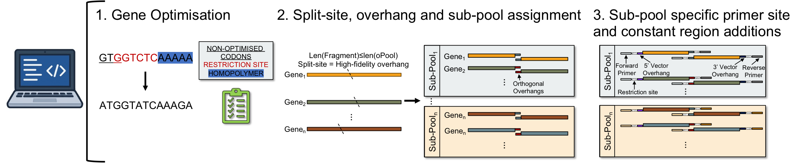
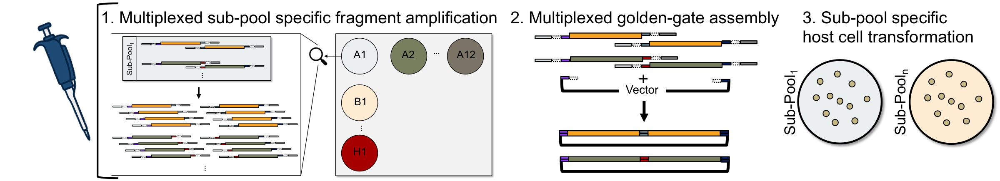
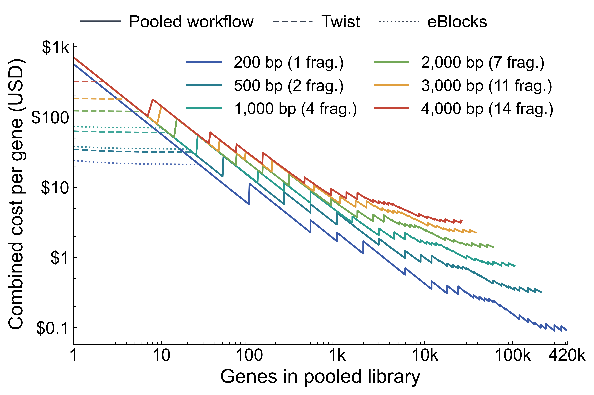

# oFORGE

*Scalable gene construction from oligonucleotide pools*

**oFORGE** — **o**ligo-pool **F**ragmentation, **O**ptimisation and **R**econstruction by **G**olden-gate **E**ngineering

[](https://colab.research.google.com/github/t-j-fryer/oFORGE/blob/main/notebooks/oPool_Cloning_Colab.ipynb)

For AI assistant handoff, settings, workflow conventions, and FAQ, see `AI_WORKFLOW_SUMMARY.md`.

## oFORGE Designer

The computational tool that optimises sequences, chooses split sites and overhangs, assigns sub-pools, and produces synthesis-ready oligos. Starting from amino-acid libraries or pre-optimised DNA, oFORGE Designer removes forbidden Type IIS sites, makes translation-preserving synonymous changes where needed, and adds the primer and assembly sequences required to order the library.



## oFORGE assembly

The wet-lab workflow: selective sub-pool PCR → Golden Gate → transformation.

**A single oPool is selectively amplified into many defined sub-pools.** The pooled DNA is handled only once: a small aliquot is added directly to a shared PCR master mix, which is distributed across wells containing sub-pool-specific primers. This minimizes consumption and pipetting of the original synthesis pool while allowing hundreds of independent assemblies to be generated in parallel.



## Why pooled construction?

Pooled oligonucleotide synthesis can substantially reduce DNA and assembly costs as library size increases, especially when longer genes can be assembled from multiple fragments within the same workflow.



*Illustrative project cost analysis; actual prices depend on supplier, synthesis scale, oligo length, and assembly assumptions. Confirm current pricing before making purchasing decisions.*

## Wet-lab protocol

### 1. Sub-pool-specific oPool amplification

On receipt, resuspend the oligonucleotide pool in approximately **15 µL nuclease-free water**. Only a small fraction of the pool is required for amplification: we routinely use **3 µL of the resuspended oPool DNA in one shared PCR master mix**, which has been sufficient for up to **four 96-well plates (384 sub-pool PCRs)**.

To minimize handling and loss of the pooled DNA, **do not pipette oPool DNA individually into each PCR well**. Instead, add the 3 µL oPool aliquot once to the common Q5 master mix, mix thoroughly, and distribute this master mix across wells containing the appropriate sub-pool-specific primer pairs.

### PCR setup

For each 25 µL reaction:

| Component | Volume |
| --- | ---: |
| Q5 Hot Start 2× Master Mix | 12.5 µL |
| Forward primer, 10 µM | 1.25 µL |
| Reverse primer, 10 µM | 1.25 µL |
| Shared oPool-containing master mix | included below |
| Nuclease-free water | to 25 µL |

For **N reactions**, prepare the shared master mix as follows:

| Component | Amount |
| --- | ---: |
| Q5 Hot Start 2× Master Mix | 12.5 × N µL |
| Resuspended oPool DNA | **3 µL total** |
| Nuclease-free water | 10 × N − 3 µL |
| **Master mix dispensed per well** | **22.5 µL** |

Dispense **22.5 µL** master mix into each well containing **1.25 µL forward primer + 1.25 µL reverse primer**.

In practice, prepare a modest excess of Q5 master mix and water to account for pipetting losses, while retaining **3 µL total oPool DNA** rather than scaling the amount of template with reaction number.

### PCR program

| Step | Temperature | Time | Cycles |
| --- | ---: | ---: | ---: |
| Initial denaturation | 98 °C | 30 s | 1 |
| Denaturation | 98 °C | 10 s | |
| Annealing | 58 °C | 10 s | **40** |
| Extension | 72 °C | 10 s | |
| Final extension | 72 °C | 2 min | 1 |
| Hold | 4 °C | ∞ | — |

Following amplification, purify PCR products using **1.8× PCRClean DX beads**. Concentration normalization of individual sub-pool PCR products is not required before Golden Gate assembly.

### 2. Multiplexed Golden Gate assembly

Fragments belonging to each sub-pool are assembled together with the compatible destination vector using BsaI-HFv2 and T4 DNA ligase.

#### Golden Gate reaction

| Component | Amount per 20 µL reaction |
| --- | ---: |
| T4 DNA Ligase Buffer, 10× | 2.0 µL |
| BsaI-HFv2 | 1.2 µL |
| T4 DNA Ligase | 0.4 µL |
| Destination vector | 50 ng |
| oPool PCR product | 0.5 µL |
| Nuclease-free water | to 20 µL |
| **Total volume** | **20 µL** |

No concentration normalization of individual oPool PCR products is required before assembly.

#### Golden Gate program

| Step | Temperature | Time | Cycles |
| --- | ---: | ---: | ---: |
| Digestion | 37 °C | 5 min | |
| Ligation | 16 °C | 5 min | **90 alternating cycles** |
| Final incubation | 65 °C | 5 min | 1 |
| Hold | 4 °C | ∞ | — |

Alternate the 37 °C digestion and 16 °C ligation steps for 90 cycles before the final 65 °C incubation.

### 3. Sub-pool-specific transformation

Transform each Golden Gate assembly independently so that the sub-pool identity of recovered colonies is retained. This coarse positional information greatly reduces the search space when individual constructs are subsequently picked, sequenced, and matched to their intended reference sequence.

> **Overall experimental workflow:** oPool → sub-pool-specific PCR → PCR cleanup → multiplexed Golden Gate assembly → separate sub-pool transformations → colony recovery

## Repository Layout

- `notebooks/oPool_Cloning_Notebook_Fast_Pool_Assignment.ipynb`: advanced modular oFORGE Designer notebook
- `notebooks/oPool_Cloning_Notebook_Simple.ipynb`: oFORGE Designer notebook; edit one input cell, then choose **Run All**
- `notebooks/oPool_Cloning_Colab.ipynb`: one-click hosted oFORGE Designer workflow
- `scripts/oforge_cli.py`: canonical oFORGE Designer terminal interface
- `scripts/opool_cli.py`: legacy-compatible terminal entry point
- `scripts/opool_workflow.py`: shared implementation used by the CLI, simple notebook, and Colab notebook
- `requirements-colab.txt`: minimal dependencies installed by the hosted notebook
- `docs/images/`: GitHub- and Colab-ready workflow and cost figures
- `data/orthogonal_oligos.csv`: default primer inventory
- `data/overhangs.csv`: default overhang inventory
- `data/AAseq_dTF001_dTF016.csv`: bundled example amino-acid library
- `data/fpbase_top500.csv`: bundled library of 500 fluorescent-protein sequences from FPbase
- `outputs/`: generated outputs from notebook runs

The existing `oPool_Cloning_*.ipynb`, `opool_cli.py`, and output-file names are retained for backward compatibility. New documentation uses the oFORGE brand and `scripts/oforge_cli.py` as the canonical CLI entry point.

## Google Colab — no local installation

Click the **Open in Colab** badge above, edit the single **User settings** cell, and choose **Runtime → Run all**.

- Leave `USE_BUNDLED_DATASET = True` and choose either bundled amino-acid library from the dropdown.
- Set it to `False` to upload one amino-acid or optimized-DNA CSV when prompted.
- The tracked `data/overhangs.csv` and `data/orthogonal_oligos.csv` inventories are used automatically.
- `GENES_PER_SUBPOOL = 0` means automatic packing with no fixed gene-count limit.
- A standard CPU runtime is sufficient.
- Every run creates a ZIP containing all CSV and FASTA outputs and downloads it automatically.
- Optional Google Drive output is available but disabled by default, so the notebook does not request Drive access unless the user chooses it.

Colab runtimes are temporary. Download the ZIP before closing the runtime unless Google Drive output was enabled.

### Exploring oligo length

The Colab notebook provides an `OPOOL_LENGTH` selector with the common orderable lengths `120`, `150`, `200`, `250`, `300`, and `350` nt. A sensible first comparison is to run the same dataset once at a shorter length and once at a longer length:

- **120–200 nt:** less coding capacity per oligo after primers and assembly elements, usually producing more fragments and more order oligos. Because each fragmented gene consumes unique internal overhangs, automatic sub-pools may also contain fewer genes.
- **250–350 nt:** more coding capacity, usually producing fewer fragments and order oligos and allowing more genes per sub-pool. Longer oligos may have different synthesis pricing or vendor constraints.

Every Colab run writes to a new timestamped folder. Compare **Total order oligos**, **Sub-pools**, and the displayed genes/oligos-per-sub-pool table. The order CSV row count is the number of oligos to purchase.

The same comparison can be run from the terminal, for example:

```bash
python scripts/oforge_cli.py --input data/fpbase_top500.csv --opool-length 120 --run-name fpbase_120
python scripts/oforge_cli.py --input data/fpbase_top500.csv --opool-length 350 --run-name fpbase_350
```

### Generating a custom overhang set with NEB GetSet

Use [NEB GetSet](https://ligasefidelity.neb.com/getset/run.cgi) to generate a high-fidelity overhang set compatible with the destination vector:

1. Enter the desired number of **internal** overhangs plus your number of **Vector Overhangs** in **Number of Overhangs**. For example, request `34` when you want 32 internal overhangs with 2 vector overhangs.
2. Enter both destination-vector overhangs in **Required Overhangs**—the 5′ and 3′ values used by this workflow. For the default vector, enter `GCTT` and `AGTG`.
3. Generate the set and copy the returned four-base overhangs. Save them as a CSV or text file, either comma-separated or one overhang per row or column.
4. Supply that set to oFORGE Designer. It is safe for the file to contain the required vector overhangs: they are recognized and automatically excluded from internal split-site assignment.

Choose the custom set in whichever interface you use:

- **Colab:** set `USE_CUSTOM_OVERHANGS = True`. Paste the GetSet values into `CUSTOM_OVERHANGS_TEXT`, or leave that field blank to upload the CSV/TXT when prompted.
- **Simple notebook:** set `OVERHANGS_FILE` to the custom CSV/TXT path in the single user-input cell.
- **Fast modular notebook:** set `OVERHANGS_PATH` to the custom CSV/TXT path in the first user-input cell.
- **CLI:** pass `--overhangs "/path/to/custom_overhangs.csv"` together with the matching `--vector-oh1` and `--vector-oh2` values.

The workflow prints the number of supplied overhangs, the number available for internal junctions, and any vector overhangs it excluded. Keep the vector-overhang settings synchronized with the values entered in GetSet.

## Python Environment + Kernel

### Option A: `venv` (recommended)

```bash
python3.11 -m venv .venv
source .venv/bin/activate
pip install --upgrade pip
pip install -r requirements.txt
python -m ipykernel install --user --name oforge --display-name "Python 3 (oFORGE)"
```

Then in Jupyter, choose kernel: `Python 3 (oFORGE)`.

### Option B: Conda/Mamba

```bash
conda env create -f environment.yml
conda activate oforge
python -m ipykernel install --user --name oforge --display-name "Python 3 (oFORGE)"
```

## Simplest notebook workflow

```bash
jupyter lab
```

Open `notebooks/oPool_Cloning_Notebook_Simple.ipynb`, edit its single **User inputs** cell, and choose **Run All**.

## Terminal workflow

After installing the environment, this command runs the complete workflow with the bundled files in `data/`:

```bash
python scripts/oforge_cli.py
```

The example outputs are written to `outputs/`. Existing files are protected, so a second run will stop rather than silently replace them.

For a real project, only the input normally needs to change. The input can be either an amino-acid CSV or an existing optimized-DNA CSV; its format is detected automatically. Headered amino-acid CSVs may use `name` with either `aa_seq` or `amino_acid_sequence`:

```bash
python scripts/oforge_cli.py --input "/path/to/amino_acids.csv"
```

### Defaults

| Setting | Default |
| --- | --- |
| Input | `data/AAseq_dTF001_dTF016.csv` |
| Internal overhangs | `data/overhangs.csv` |
| Orthogonal primers | `data/orthogonal_oligos.csv` |
| Oligo length | 250 nt |
| Vector overhangs | `GCTT` / `AGTG` |
| Genes per sub-pool | automatic packing; no fixed limit |
| Primer mode | combinatorial |
| Type IIS enzyme settings | `GGTCTC` recognition site plus separate `A` N-base |
| Codon host | *E. coli* |
| Leading methionine | stripped |

The two inventory paths are resolved from the repository, even if the command is launched from another directory. Relative project input paths are resolved from the current directory; paths beginning with `data/` always refer to this repository's bundled data.

Override only the settings your assembly requires. The following is a fully explicit example using non-default vector overhangs. First generate a custom overhang set with NEB GetSet using `TATG` and `GGAT` in **Required Overhangs**, then save that set as `/path/to/custom_overhangs.csv`:

```bash
python scripts/oforge_cli.py \
  --input "/path/to/optimized_dna.csv" \
  --opool-length 350 \
  --overhangs "/path/to/custom_overhangs.csv" \
  --vector-oh1 TATG \
  --vector-oh2 GGAT \
  --genes-per-subpool 1
```

This command uses `TATG` and `GGAT` as the 5′ and 3′ vector overhangs, respectively; selects internal junctions from the matching custom overhang file; produces final synthesis oligos that are 350 nt long, including primer and assembly elements; and assigns exactly one gene to each sub-pool. The vector overhangs may be present in the custom GetSet file because oFORGE excludes them automatically from internal split-site assignment.

Run this for all options and their defaults:

```bash
python scripts/oforge_cli.py --help
```

For external inputs, outputs are written beside the input file by default. Choose a different `--run-name`/`--output-dir`, or explicitly pass `--force` to replace existing outputs.

### Type IIS vector-boundary safety

Pool assignment checks the configured Type IIS recognition sequence and its reverse complement across both vector-overhang/coding-sequence boundaries. If a boundary creates a site, the workflow searches for the smallest synonymous coding change, rebuilds the affected fragments, and leaves both vector overhangs unchanged. It fails with an explicit error when no synonymous repair is possible rather than altering an overhang or protein sequence.

Repairs are recorded in `<run_name>_vector_boundary_synonymous_corrections.csv`; the file is written with headers even when no repair is needed.

### Codon-optimization species

For amino-acid inputs, set `CODON_SPECIES` in the simple or fast notebook, or pass `--codon-species` to the CLI. The default is `e_coli`. The built-in species keywords supplied by `python_codon_tables` are:

| Species | Short keyword | Full table name |
| --- | --- | --- |
| *Bacillus subtilis* | `b_subtilis` | `b_subtilis_1423` |
| *Caenorhabditis elegans* | `c_elegans` | `c_elegans_6239` |
| *Drosophila melanogaster* | `d_melanogaster` | `d_melanogaster_7227` |
| *Escherichia coli* | `e_coli` | `e_coli_316407` |
| *Gallus gallus* | `g_gallus` | `g_gallus_9031` |
| *Homo sapiens* | `h_sapiens` | `h_sapiens_9606` |
| *Mus musculus* | `m_musculus` | `m_musculus_10090` |
| *Mus musculus domesticus* | `m_musculus_domesticus` | `m_musculus_domesticus_10092` |
| *Saccharomyces cerevisiae* | `s_cerevisiae` | `s_cerevisiae_4932` |

Either the short keyword or full table name is accepted. Alternatively, use a numeric NCBI taxonomy ID; DnaChisel will then need internet access to retrieve its codon table. This setting is ignored when the input already contains optimized DNA.

## Notes

- Notebook defaults use the bundled files in `data/` and write example outputs into `outputs/`.
- If you switch to your own datasets, update the single user-input cell in the simple notebook or the top configuration cell in the fast notebook.

## Acknowledgements and references

oFORGE builds on the open-source scientific Python ecosystem. In particular:

- Gene optimization uses [DnaChisel](https://github.com/Edinburgh-Genome-Foundry/DnaChisel): Zulkower V, Rosser S. “DNA Chisel, a versatile sequence optimizer.” *Bioinformatics* 36(16), 4508–4509 (2020). [doi:10.1093/bioinformatics/btaa558](https://doi.org/10.1093/bioinformatics/btaa558).
- Sequence representation, translation, and reverse-complement operations use [Biopython](https://biopython.org/): Cock PJA et al. “Biopython: freely available Python tools for computational molecular biology and bioinformatics.” *Bioinformatics* 25(11), 1422–1423 (2009). [doi:10.1093/bioinformatics/btp163](https://doi.org/10.1093/bioinformatics/btp163).
- Codon-usage tables are supplied by [python-codon-tables](https://github.com/Edinburgh-Genome-Foundry/python_codon_tables).
- The bundled fluorescent-protein library was sourced from [FPbase](https://www.fpbase.org/): Lambert TJ. “FPbase: a community-editable fluorescent protein database.” *Nature Methods* 16, 277–278 (2019). [doi:10.1038/s41592-019-0352-8](https://doi.org/10.1038/s41592-019-0352-8). Individual proteins may have additional primary references listed by FPbase.
- Data handling and numerical operations use [pandas](https://pandas.pydata.org/) and [NumPy](https://numpy.org/).
- The hosted notebook runs on [Google Colab](https://colab.research.google.com/).
- The bundled overhang inventory is intended for use with experimentally informed Golden Gate overhang selection. [NEB GetSet](https://ligasefidelity.neb.com/getset/run.cgi) generates compatible high-fidelity junction sets from required vector overhangs; NEB also provides broader [Ligase Fidelity tools](https://www.neb.com/en-us/applications/cloning-and-synthetic-biology/dna-assembly-and-cloning/golden-gate-assembly/ligase-fidelity).

These projects and services retain their own licenses and trademarks. oFORGE is not affiliated with or endorsed by their maintainers or providers.

## License

oFORGE is released under the [MIT License](LICENSE).
